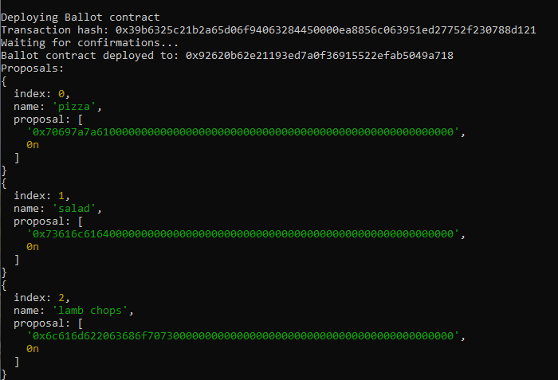

# Overview: Encode Club EVM Bootcamp Group 2, Assignment 2
Using his disassociated developer wallet, [*DAaJDn - Github: @codesport*](https://github.com/codesport)  deployed [`Ballot.sol`](contracts/Ballot.sol) with Viem using the [`deploy-ballot-viem.ts`](scripts/deploy-ballot-viem.ts) script. 

The contract's address is [0x92620b62e21193ed7a0f36915522efab5049a718](https://sepolia.etherscan.io/address/0x92620b62e21193ed7a0f36915522efab5049a718).  The creation (i.e., deploy) transaction is located at [0x39b6325c21b2a65d06f94063284450000ea8856c063951ed27752f230788d121](https://sepolia.etherscan.io/tx/0x39b6325c21b2a65d06f94063284450000ea8856c063951ed27752f230788d121) on the Sepolia testnet.

`call-any-Function.ts` and `task-ballot.ts` were used from the CLI to execute read and write functions within `Ballot.sol`. 

 [`call-any-Function.ts`](scripts/call-any-function.ts) is a wrapper that parses arguments and calls a function within a given file.

 [`task-ballot.ts`](scripts/tasks-ballot.ts) contains the functions which execute voting and delegating on the contract.

Usage is as follows:

`$ npx ts-node call-any-Function.ts /<script-name>/<function-name>/<argument1>/<argument2>`


## Deliverables

* Develop and run scripts for “Ballot.sol” within your group to give voting rights, casting votes, delegating votes and querying results
* Write a report with each function execution and the transaction hash, if successful, or the revert reason, if failed

# Deploy Ballot.sol

The contract creation (i.e., deploy) transaction is located at [0x39b6325c21b2a65d06f94063284450000ea8856c063951ed27752f230788d121](https://sepolia.etherscan.io/tx/0x39b6325c21b2a65d06f94063284450000ea8856c063951ed27752f230788d121) on the Sepolia testnet.

"Pizza", "Salad", and "Lamb Chops" were chosen as proposals.  The screenshot below summarizes the contract deploy output:

)


# Give Voting Rights

Voting writes were given to the following participants:

* ExqPpl - Github: @pondskai 
* tJnNuQ - Github: @maomaosaosao 
* R9dhTD - Github: @brianblank
* lofjwH - Github: @fang10000
* Mn8EN0 - Github: @ethalorian
* HPJ2do - Github: @DiegoB1911 


In this scenario user **[DAaJDn] @codesport** performed actions as the Ballot.sol "chairperson".  The following was run from the CLI to give each team member voting rights:

`$ npx ts-node call-any-function.ts tasks-ballot.ts/assignVoter/<userWalletAddress>/<ballotContractAddress>`

where:
`ballotContractAddress` = [0x92620b62E21193ed7A0f36915522EFab5049A718](https://sepolia.etherscan.io/address/0x92620b62E21193ed7A0f36915522EFab5049A718)

Below are screenshots and transaction hashes of these actions:

+ [ExqPpl] @pondskai
   - [0x31c17ede44b91518d6501faeeca94281f59897b645d234b15c95e013e144e09](https://sepolia.etherscan.io/tx/0x31c17ede44b91518d6501faeeca94281f59897b645d234b15c95e013e144e094)
   

+ [R9dhTD] @brianblank 

  - https://sepolia.etherscan.io/tx/0xed20f6da03fae521e82295062b116597f3b99e6d04a272d8c528c1303c3edf8f
  
  
+ [lofjwH] @fang10000

   - [0x06ea427dac4897137e235e6b190e279f1544dead57a233bba6292c45d97ead4c](https://sepolia.etherscan.io/tx/0x06ea427dac4897137e235e6b190e279f1544dead57a233bba6292c45d97ead4c) 
   

+ [Mn8EN0] @ethalorian
    - [0x31c17ede44b91518d6501faeeca94281f59897b645d234b15c95e013e144e094](https://sepolia.etherscan.io/tx/0x31c17ede44b91518d6501faeeca94281f59897b645d234b15c95e013e144e094)  
   

+ [HPJ2do] @DiegoB1911 
   - https://sepolia.etherscan.io/tx/0xc801ac3f3f27d7138559cf09d979816a992753a55150af575ef171cab88c6252
   


# Casting Votes
Three team members casted votes. Their wallet address and voting transactions are as follows:
1 [0xe429f5e3a91b4932ae3022de3e3ca0f6a911eeca](https://sepolia.etherscan.io/tx/0x1647129dc766ea38aa06f56c20efbcda97ba7b54758917f6a6bdf9f201fc4fcb)
1 [0x1c218834059df5c5bb0421e28a131aa5ee3cbc95](https://sepolia.etherscan.io/tx/0xc5aa37f1d7a1cebd74640b627548774988c13ff84dfd14b00659a799e2f38ee0)
1 [0x9e3885eccdc7e6f61b291b03838313f83799e03a](https://sepolia.etherscan.io/tx/0x95150edaaf413a3da0646af457c2d02e69af3446bd185c671403ace830b2de58)

```
// npx ts-node call-any-function.ts tasks-ballot.ts.ts/castVote/1/0x92620b62E21193ed7A0f36915522EFab5049A718
const castVote = async ( proposalIndex: BigInt, contractAddress: `0x${string}` ) => {

  //  const proposalIndex = inputs[0] as BigInt;

    if (!contractAddress) 
        throw new Error("Contract address not provided");

    if (!/^0x[a-fA-F0-9]{40}$/.test(contractAddress))
        throw new Error("Invalid contract address");

    if (isNaN(Number(proposalIndex))) 
        throw new Error("Invalid proposal index");


    const proposal = ( await publicClient.readContract({
        address: contractAddress,
        abi,
        functionName: "proposals",
        args: [proposalIndex],
    })) as any[];

    const name = hexToString(proposal[0], { size: 32 });
    console.log("Voting on proposal:", name);


    const voteHash = await walletClient.writeContract({
        abi: abi,
        address: contractAddress!, // OR USE: as `0x${string}`
        functionName: "vote",
        args:[proposalIndex]  // BigInt(proposalIndex) 
    });

    
 	console.log("Transaction hash:", voteHash);
	console.log("Waiting for confirmations...");
	let receipt = await publicClient.waitForTransactionReceipt({ hash: voteHash });
	console.log(receipt.from, "has successfully Voted for ", name );
    

}
```
# Delegating Votes
TBD

# Querying Results
```
// npx ts-node call-any-function.ts tasks-ballot.ts/queryUsers/0x92620b62E21193ed7A0f36915522EFab5049A718

const queryUsers = async ( contractAddress: `0x${string}` ) => {

    // struct Voter {
    //     uint weight; // weight is accumulated by delegation
    //     bool voted;  // if true, that person already voted
    //     address delegate; // person delegated to
    //     uint vote;   // index of the voted proposal
    // }


    // // This declares a state variable that stores a `Voter` struct for each possible address.
    // mapping(address => Voter) public voters;
    // must know voter address a priori to query their specific "profile"
    // use this: https://sepolia.etherscan.io/address/0x92620b62e21193ed7a0f36915522efab5049a718

    let addressArray: string[] = ['0x9E3885eCcDc7E6F61B291B03838313F83799e03A', '0x1c218834059Df5C5BB0421E28A131Aa5Ee3cbc95', '0xe429F5E3A91b4932aE3022de3E3Ca0F6A911eECa'];
    let i = 0;

    //https://www.google.com/search?client=opera&q=asynch+foreach+loop+in+tyspescript
    // forEach doesn't directly support async/await. achieve similar functionality in TypeScript using the for...of loop
    for (const singleAddress of addressArray ) {
        i++;
        const userProfiles = await publicClient.readContract({
            address: contractAddress,
            abi,
            functionName: "voters", //this is actually reading  state variable, not a function!
            args: [singleAddress]
        }) as any[]// any[];
        
        const[ weight, voteStatus, delegate, proposalIndex ] = userProfiles
        console.log("Voter", singleAddress, "profile:")
        ///console.log({ userProfiles  });
        console.log("Voting Weight:", weight, ", Already Vote?:",  voteStatus, ", Delegated Address:", delegate, ", Prposal Voted For:",  proposalIndex )
        console.log(" ")
    }
}
```
